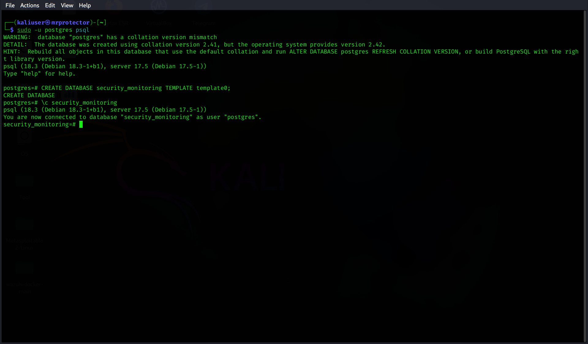
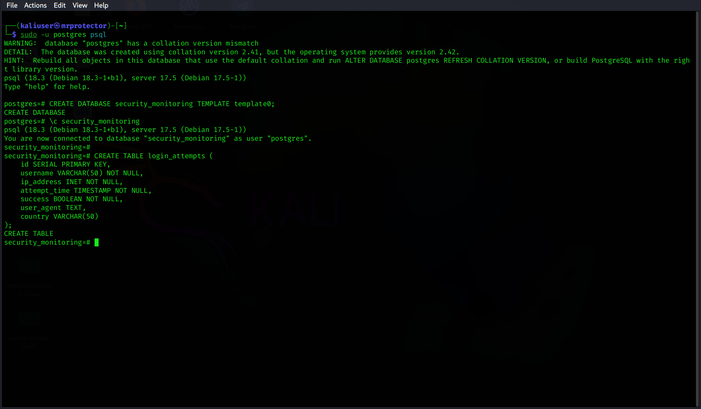
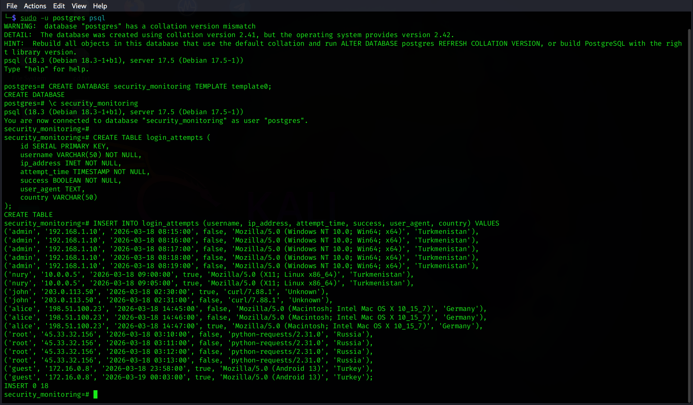
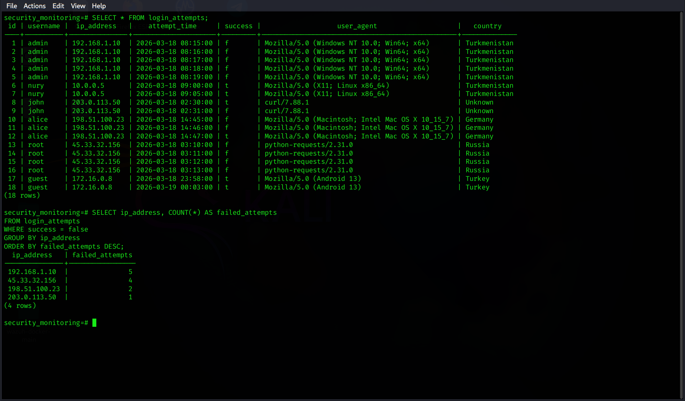

# Login Monitoring with PostgreSQL

This is a small SQL project I built in Kali Linux to practice working with authentication logs in PostgreSQL.

Instead of using a standard business dataset, I created a table of login attempts and then analyzed it with SQL queries to find suspicious IP addresses and possible brute-force activity.

## Project files

- `schema.sql` — table structure
- `data.sql` — sample login data
- `detection_queries.sql` — SQL queries used for analysis
- `screenshots/` — screenshots of the setup and results

## What I did

1. Created a PostgreSQL database called `security_monitoring`
2. Connected to the database in `psql`
3. Created a table called `login_attempts`
4. Inserted sample login records
5. Queried the data to identify suspicious patterns

## Table structure

The `login_attempts` table contains:

- `id`
- `username`
- `ip_address`
- `attempt_time`
- `success`
- `user_agent`
- `country`

This structure makes it possible to store login activity and analyze failed authentication attempts.

## Project Steps

### 1. Database setup


I created the `security_monitoring` database and connected to it in PostgreSQL using `psql`. 
This was the starting point for the whole project, since all further work was done inside this database.

### 2. Table creation


After connecting to the database, I created the `login_attempts` table.  
The table stores key login event fields such as username, IP address, timestamp, login result, user agent, and country.

### 3. Data insertion


Next, I inserted a sample dataset into the `login_attempts` table. The dataset includes both successful and failed logins from different IP addresses, which made it possible to run simple security analysis queries.

### 4. Data review and failed attempts by IP


I first reviewed the stored records and then grouped failed login attempts by IP address. This helped identify which IPs generated the highest number of failed authentication attempts.

### 5. Brute-force detection


Finally, I applied a simple rule to detect possible brute-force sources by filtering IP addresses with 3 or more failed login attempts. This query highlighted the most suspicious IPs in the dataset.

## SQL analysis

### Query 1: Failed login attempts by IP

This query was used to count failed logins for each IP address:

```sql
SELECT ip_address, COUNT(*) AS failed_attempts
FROM login_attempts
WHERE success = false
GROUP BY ip_address
ORDER BY failed_attempts DESC;
```

### Result

The query returned the following failed login counts:

- `192.168.1.10` → **5** failed attempts
- `45.33.32.156` → **4** failed attempts
- `198.51.100.23` → **2** failed attempts
- `203.0.113.50` → **1** failed attempt

### Interpretation

The most suspicious IP addresses in this dataset are:

- `192.168.1.10`
- `45.33.32.156`

These two IP addresses generated the highest number of failed login attempts, so they can be treated as the most suspicious sources in this sample dataset.

### Query 2: Potential brute-force detection

This query was used to find IP addresses with 3 or more failed login attempts:
```sql
SELECT ip_address, COUNT(*) AS failed_attempts
FROM login_attempts
WHERE success = false
GROUP BY ip_address
HAVING COUNT(*) >= 3
ORDER BY failed_attempts DESC;
```
## Result
This query returned:
- `192.168.1.10` → 5 failed attempts
- `45.33.32.156` → 4 failed attempts

## Interpretation
Using a simple threshold of 3 failed attempts, both of these IP addresses can be treated as potential brute-force sources in this test scenario.

## Additional Observations

A few other details in the dataset also stand out:

- `45.33.32.156` used the user agent `python-requests/2.31.0`, which may indicate automated activity.
- `203.0.113.50` used `curl/7.88.1`, which is unusual for a normal user login.
- The account `admin` received repeated failed attempts from `192.168.1.10`.
- The account `root` received repeated failed attempts from `45.33.32.156`.

These patterns make the dataset more realistic for security-focused SQL practice.

## Conclusion

This project helped me practice SQL in a more practical way by using login monitoring data instead of a generic dataset.

Based on the queries, the main findings are:

- `192.168.1.10` and `45.33.32.156` are the most suspicious IP addresses in the dataset.
- Both meet the threshold for possible brute-force behavior.
- Repeated failed attempts, especially with tools like `curl` and `python-requests`, are useful indicators during log analysis.

Overall, this project was a good way to practice SQL on a more realistic security-related task instead of just working with a generic dataset.
